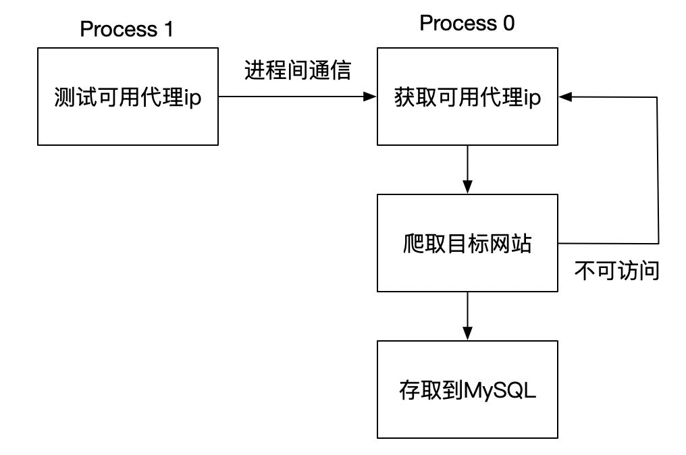

# Douban House Crawler: A Proxy Pool Method
> Use proxy ip pool to tackle anti-spider of Douban

## Project structure

## Main dependencies
- requests
- MySQL 

## How to run
- :beer: [Env] Run `pip install -r requirments.txt` to install the env
- :beer: [DB] In MySQL console, run source houses.sql
- :beer: [Custom] Modify conditions in `config.py`
- :beer: [Proxy Pool] clone [this repo](https://github.com/jhao104/proxy_pool), and run `docker-compose up`
- :rocket: [Run] `python main.py`
